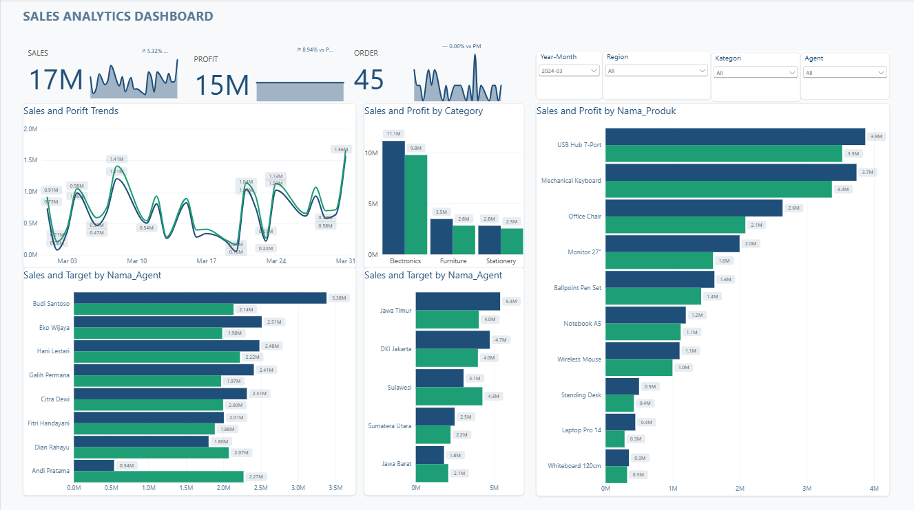

# Sales Analytics Dashboard


## Overview

This project analyzes sales performance to provide insights into revenue,
profit, orders, product performance, category performance, regional
performance, and sales agent performance.

The analysis was developed using Microsoft Power BI to transform sales data
into an interactive dashboard that helps users explore business performance
across different dimensions.

---

## Dashboard Preview



---

## Key Metrics

| Metric | Value |
|---|---:|
| Total Sales | 17M |
| Total Profit | 15M |
| Total Orders | 45 |

> Values shown above reflect the dashboard view and may change when filters
> are applied.

---

## Objectives

The main objectives of this project are:

- Monitor overall sales performance.
- Analyze sales and profit trends over time.
- Compare sales and profit across product categories.
- Identify top-performing products.
- Compare sales performance between sales agents.
- Analyze sales and target performance by agent.
- Analyze regional sales and target performance.
- Provide interactive filtering for business analysis.

---

## Business Questions

This dashboard was designed to answer questions such as:

1. How are sales and profit performing over time?
2. Which product categories generate the highest sales and profit?
3. Which products contribute the most to sales?
4. Which sales agents generate the highest sales?
5. How does actual sales performance compare with targets?
6. Which regions contribute the most to sales?
7. Which products and agents require further investigation?
8. How does sales performance change based on time, region, category,
   and agent?

---

## Key Analysis

### 1. Sales and Profit Trends

The dashboard tracks sales and profit over time to identify changes in
business performance.

The trend visualization allows users to compare sales and profit movements
across different dates and identify periods of higher or lower performance.

---

### 2. Sales and Profit by Category

The dashboard compares sales and profit across product categories.

The analyzed categories include:

- Electronics
- Furniture
- Stationery

This comparison helps identify differences in revenue and profit contribution
between product categories.

---

### 3. Sales and Profit by Product

The dashboard provides a product-level comparison of sales and profit.

Products displayed in the analysis include:

- USB Hub 7-Port
- Mechanical Keyboard
- Office Chair
- Monitor 27"
- Ballpoint Pen Set
- Notebook A5
- Wireless Mouse
- Standing Desk
- Laptop Pro 14
- Whiteboard 120cm

This visualization helps identify products with relatively high sales and
profit contribution.

---

### 4. Sales Performance by Agent

The dashboard compares sales performance across individual sales agents.

The analysis includes agents such as:

- Budi Santoso
- Eko Wijaya
- Hani Lestari
- Galih Permana
- Citra Dewi
- Fitri Handayani
- Dian Rahayu
- Andi Pratama

The comparison helps identify differences in sales performance between agents.

---

### 5. Sales vs Target by Agent

Actual sales are compared with target values for each sales agent.

This provides a performance-oriented view that can be used to identify agents
who are above or below their assigned targets.

---

### 6. Sales vs Target by Region

The dashboard also compares actual sales and target values across regions.

The displayed regions include:

- Jawa Timur
- DKI Jakarta
- Sulawesi
- Sumatera Utara
- Jawa Barat

This provides a regional perspective on sales performance and target
achievement.

---

## Interactive Dashboard

The dashboard provides several interactive filters:

- **Year-Month**
- **Region**
- **Category**
- **Agent**

These filters allow users to analyze specific periods, regions, categories,
and sales agents.

For example, users can select a specific region and category to examine how
sales performance changes within that segment.

---

## Dashboard Components

The dashboard includes:

- Sales KPI
- Profit KPI
- Order KPI
- Sales and profit trend analysis
- Sales and profit by category
- Sales and profit by product
- Sales vs target by agent
- Sales vs target by region
- Interactive filters

---

## Data Analysis Process

The project follows a typical business intelligence workflow:

```text
Raw Sales Data
      ↓
Data Preparation
      ↓
Data Cleaning
      ↓
Data Transformation
      ↓
Data Modeling
      ↓
DAX Measures
      ↓
Exploratory Analysis
      ↓
Data Visualization
      ↓
Interactive Dashboard
      ↓
Business Insights
